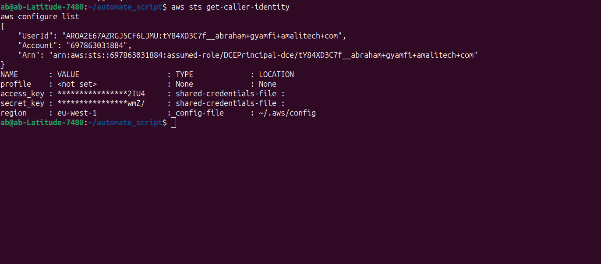
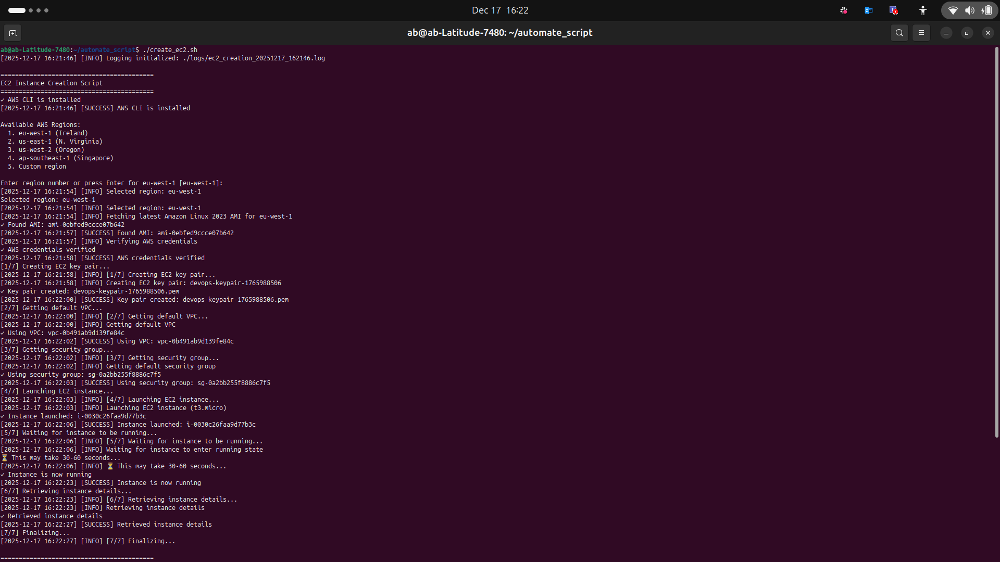
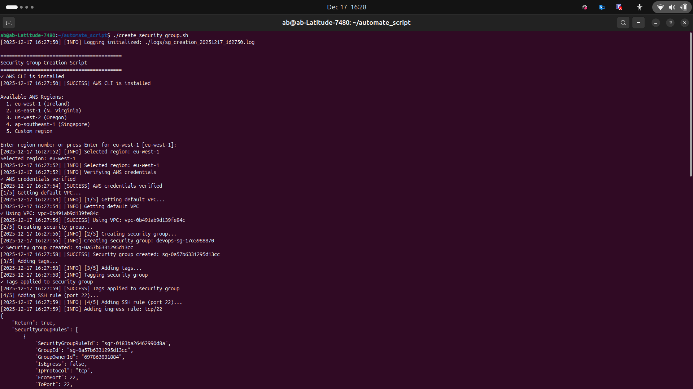
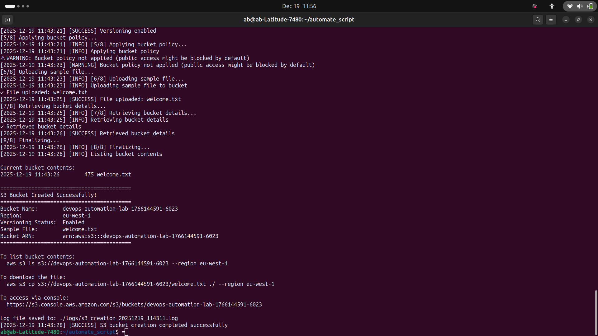

# AWS Resource Automation with Bash Scripts

Automated Bash scripts for creating and managing AWS resources (EC2, Security Groups, S3) using AWS CLI with comprehensive logging and error handling.

## 📁 Project Structure

```
automate_script/
├── common_functions.sh        # Shared utility functions
├── create_ec2.sh              # EC2 instance automation
├── create_security_group.sh   # Security group automation
├── create_s3_bucket.sh        # S3 bucket automation
├── cleanup_resources.sh       # Resource cleanup automation
├── logs/                      # Execution logs
└── screenshots/               # Execution screenshots
```

## 🚀 Quick Setup

### 1. Install & Configure AWS CLI
```bash
# Install AWS CLI (Linux/macOS)
curl "https://awscli.amazonaws.com/awscli-exe-linux-x86_64.zip" -o "awscliv2.zip"
unzip awscliv2.zip && sudo ./aws/install

# Configure credentials
aws configure

# Verify
aws sts get-caller-identity
```



### 2. Setup Scripts
```bash
cd automate_script
chmod +x *.sh
```

**Prerequisites:** AWS account with EC2, S3, and IAM permissions

## 📖 Scripts Overview

### 🔧 common_functions.sh
Shared utility functions (logging, error handling, AWS validation, region selection) used across all scripts for code reusability and consistency.

### 🖥️ create_ec2.sh
Creates EC2 instance with key pair, tags it `Project=AutomationLab`, and outputs instance ID, public IP, and SSH connection command.

```bash
./create_ec2.sh
# Output: Instance ID, Public IP, SSH command
```



### 🔐 create_security_group.sh
Creates security group with SSH (port 22) and HTTP (port 80) access, displays security group ID and rules.

```bash
./create_security_group.sh
# Output: Security Group ID, configured rules
```



### 🪣 create_s3_bucket.sh
Creates uniquely named S3 bucket with versioning enabled, uploads `welcome.txt`, and generates pre-signed URL.

```bash
./create_s3_bucket.sh
# Output: Bucket name, versioning status, pre-signed URL
```



### 🧹 cleanup_resources.sh
Safely deletes all resources tagged with `Project=AutomationLab` after user confirmation. Supports single or all regions.

```bash
./cleanup_resources.sh
# Warning: Permanently deletes resources!
```


## 📝 Usage

```bash
# Create resources
./create_security_group.sh

**Screenshots:** See [screenshots/](screenshots/) directory for execution examples
./create_s3_bucket.sh
./create_ec2.sh

# Cleanup when done
./cleanup_resources.sh
```

**Logs:** All executions logged to `./logs/` directory with timestamps

## 🎯 Challenges & Solutions

### Challenge 1: AMI Region Compatibility
**Problem:** AMIs are region-specific
**Solution:** Implemented dynamic AMI lookup based on selected region

### Challenge 2: S3 Bucket Naming
**Problem:** S3 bucket names must be globally unique
**Solution:** Added timestamp and random number to bucket names

### Challenge 3: Security Group Dependencies
**Problem:** Cannot delete security groups attached to running instances
**Solution:** Cleanup script terminates instances first, then waits before deleting security groups

### Challenge 4: Code Duplication
**Problem:** Same functions repeated across multiple scripts
**Solution:** Created `common_functions.sh` for shared utilities

### Challenge 5: Error Handling
**Problem:** Scripts continued after errors
**Solution:** Implemented `set -euo pipefail` and error checking after each AWS command

## 📊 Cost Considerations

- **EC2:** t3.micro instances eligible for free tier
- **S3:** Storage costs apply after free tier limits
- **Data Transfer:** Outbound data transfer charges may apply
- **Recommendation:** Always run cleanup script to avoid ongoing charges

## 📂 Actual Repository Structure

```
aws_resource_automation/
├── common_functions.sh           # Shared utility functions (104 lines)
├── create_ec2.sh                 # EC2 instance automation (99 lines)
├── create_security_group.sh      # Security group automation (109 lines)
├── create_s3_bucket.sh           # S3 bucket automation (117 lines)
├── cleanup_resources.sh          # Resource cleanup automation (108 lines)
├── welcome.txt                   # Sample file for S3 upload
├── README.md                     # Project documentation
└── logs/                         # Directory for execution logs
```

### Key Components

**Core Scripts:**
- **common_functions.sh**: Provides reusable utility functions including logging, error handling, AWS CLI validation, and region selection
- **create_ec2.sh**: Handles EC2 instance provisioning with AMI lookup, key pair management, and VPC configuration
- **create_security_group.sh**: Manages security group creation with ingress rules and project tagging
- **create_s3_bucket.sh**: Automates S3 bucket creation with versioning, tagging, and sample file uploads
- **cleanup_resources.sh**: Safely removes all project resources with multi-region support and user confirmation

**Supporting Files:**
- **welcome.txt**: Auto-generated sample file demonstrating S3 upload capabilities
- **logs/**: Contains timestamped execution logs for all script runs