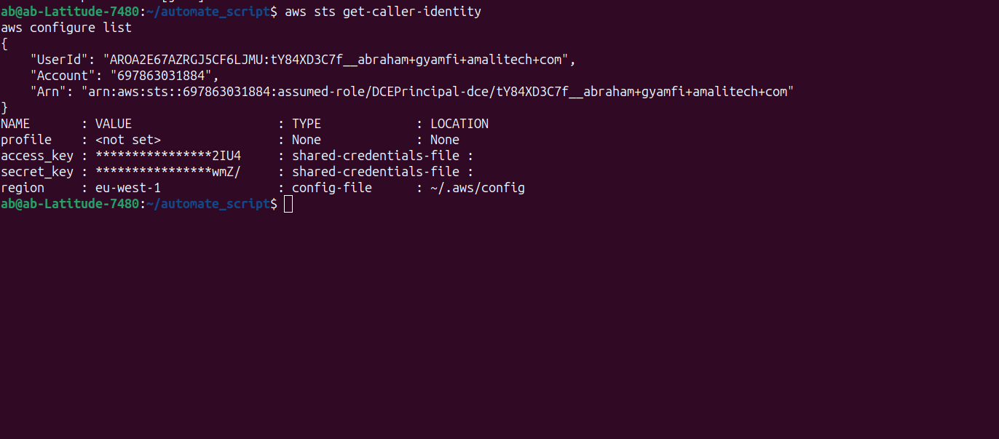
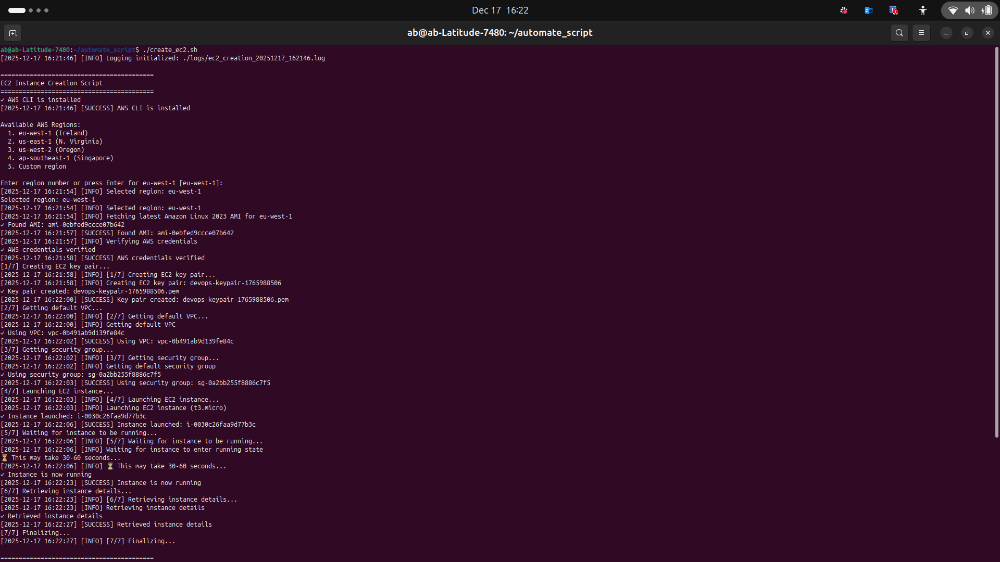
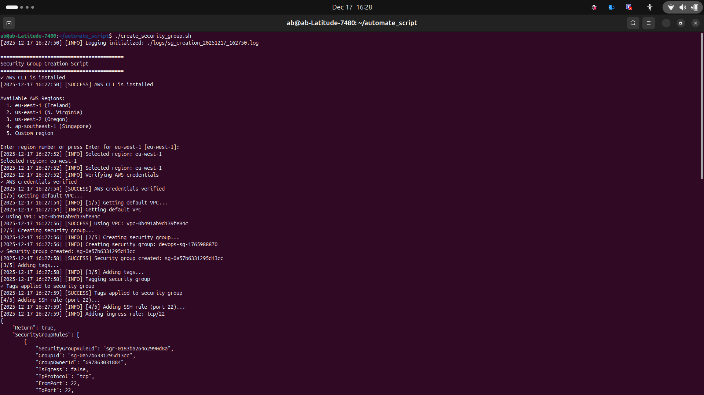
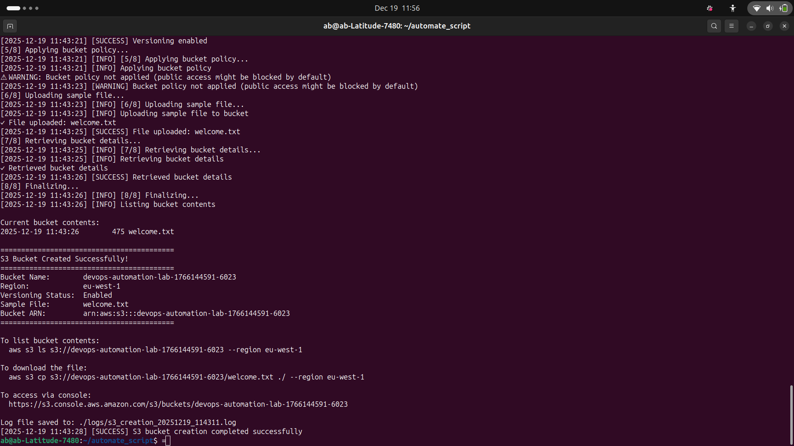

# AWS Resource Automation with Bash Scripts

Automated Bash scripts for creating and managing AWS resources (EC2, Security Groups, S3) using AWS CLI with comprehensive logging and error handling.

## 📁 Project Structure

```
automate_script/
├── common_functions.sh        # Shared utility functions + session management
├── create_ec2.sh              # EC2 instance automation
├── create_security_group.sh   # Security group automation
├── create_s3_bucket.sh        # S3 bucket automation
├── cleanup_resources.sh       # Resource cleanup automation
├── .script_session_id         # Auto-generated session identifier (gitignored)
├── logs/                      # Execution logs
└── screenshots/               # Execution screenshots
```

## 🚀 Quick Setup

### 1. Install & Configure AWS CLI
```bash
# Install AWS CLI (Linux/macOS)
curl "https://awscli.amazonaws.com/awscli-exe-linux-x86_64.zip" -o "awscliv2.zip"
unzip awscliv2.zip && sudo ./aws/install

# Configure credentials
aws configure

# Verify
aws sts get-caller-identity
```



### 2. Setup Scripts
```bash
cd automate_script
chmod +x *.sh
```

**Prerequisites:** AWS account with EC2, S3, and IAM permissions

## 📖 Scripts Overview

### 🔧 common_functions.sh
Shared utility functions (logging, error handling, AWS validation, region selection, script session management) used across all scripts for code reusability and consistency.

### 🖥️ create_ec2.sh
Creates EC2 instance with key pair, tags it with `Project=AutomationLab` and unique `ScriptManaged` session ID, outputs instance ID, public IP, and SSH connection command.

```bash
./create_ec2.sh
# Output: Instance ID, Public IP, SSH command
```



### 🔐 create_security_group.sh
Creates security group with SSH (port 22) and HTTP (port 80) access, displays security group ID and rules.

```bash
./create_security_group.sh
# Output: Security Group ID, configured rules
```



### 🪣 create_s3_bucket.sh
Creates uniquely named S3 bucket with versioning enabled, uploads `welcome.txt`, and generates pre-signed URL.

```bash
./create_s3_bucket.sh
# Output: Bucket name, versioning status, pre-signed URL
```



### 🧹 cleanup_resources.sh
Safely deletes resources using two-level filtering (`Project=AutomationLab` + `ScriptManaged` session ID). Only deletes script-created resources, protecting manual/developer resources. Prompts for confirmation if no session file exists.

```bash
./cleanup_resources.sh
# Warning: Permanently deletes resources!
```


## 📝 Usage

```bash
# Create resources
./create_security_group.sh
./create_s3_bucket.sh
./create_ec2.sh

# Cleanup when done
./cleanup_resources.sh
```

**Session Management:** Scripts automatically track resources using `.script_session_id` file. Cleanup only deletes script-created resources, protecting manual/developer resources. Delete `.script_session_id` to start a fresh session.

**Screenshots:** See [screenshots/](screenshots/) directory for execution examples

**Logs:** All executions logged to `./logs/` directory with timestamps
 ! [rejected]        main -> main (non-fast-forward)
error: failed to push some refs to 'github.com:AbrahamGyamfi/aws_resource_automation.git'
hint: Updates were rejected because the tip of your current branch is behind
hint: its remote counterpart. If you want to integrate the remote changes,
hint: use 'git pull' before pushing again.
hint: See the 'Note about fast-forwards' in 'git push --help' for details.

## 🛠️ Troubleshooting

- **Permission Denied:** Run `chmod +x *.sh`
- **AWS Credentials:** Run `aws configure` and verify with `aws sts get-caller-identity`
- **Resource Failures:** Check IAM permissions, AWS quotas, and logs in `./logs/`
- **Region Issues:** Ensure AMI availability in selected region
